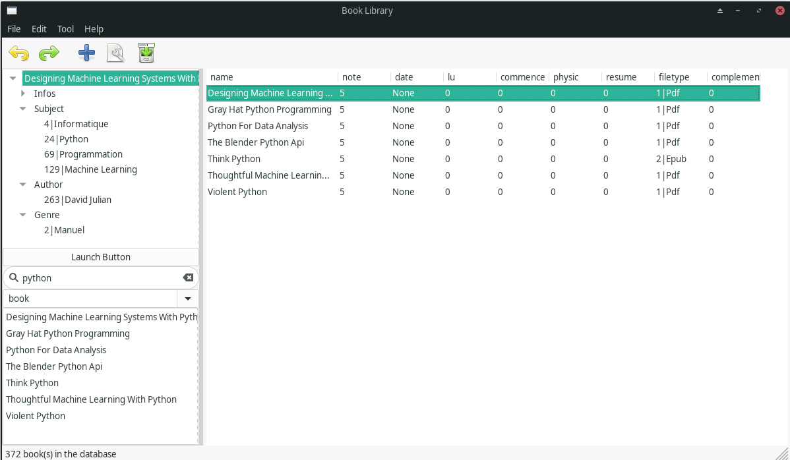

# Book_lib_new

book_lib_new is a program developped in python3 with
wxWidget and sqlite.

I wanted a sort of *iTunes* for my ebooks, but feels that
there was too much options that I don't use in *Calibre*.

Also, unlike many management programs, I wanted to use
*sqlite* to get the swiftness and fonctionnality
of a SGBD.

To stay with a simple and light program, I wanted to have as
less dependencies as possible. So, the only dependency is *wxWidget*.

Main functionnalities:
- Fast Searching
- Fast access to ebooks, by searching or reference from others ebooks.
- Classification by Author, Subject, Genre (book, article, textbook etc.), Edition
- Use system software to read ebook (no epub or pdf reader included)
- Fast access to a resume of the ebook written by yourself
- Fast access to a complement for the ebook. You know, like when Humble Bundle
makes you download a 5Gb folder with your book.

The program is far from being complete.
For now, we can't add,remove or modify books in the interface.
(but it's feasible through python classes).



# Lauching

```
python gui.py
```

# Install

Ensure that you have python3 and wxPython installed

```
python -v && pip install wxPython
```

On Ubuntu, it may be
```
python3 -v && pip3 install wxPython
```

Uncomment the two lasts lines of the file `generate.sh` and launch it
```
sh generate.sh
```
(I recommend to comment them again)

Create the file `config.py` and copy that in:
```
configuration = {
        "PATH" : {
            "rootPath" : "/path/to/the/root/of/the/books/",
            "bookPath" : "/name/of/the/books/folder",
            "databasePath" :
                "data.db",
            "complementPath" : "/path/to/the/complement/book/folder",
            "resumePath" : "/path/to/the/resume/book/folder",
            },
        "READER" : {
            "pdfReader" : "evince",
            "epubReader" : "zathura",
            "djvuReader" : "evince",
            },
        "HISTORY" : {
            "historyLength" : 25
            }
        }
```
Modify it to configure the program

That's installed !

(The procedure will be simplified someday)

# Cli Tool

You can handle books with the cli tool (Very Beta).

Adding the book to the database.
This will copy the book to the database folder,
and add the book to the sqlite3 database with the good
file type (everything you need to be able to launch the book).
Unfortunatly adding Authors, Subjects, Genre or others informations
is not possible now.
```
python cli.py <path_to_the_book>
```
# Todo

- Make all menu items works properly
- Make instant search instead of button Search
- Better searching algorithm : fuzzy finding, multi category search, full text search ...
- Proper management of categories (list of category etc.)
- Right click on books open a menu : copy the link in the database, or open the book, mark as read, add a resume, add a complement...
